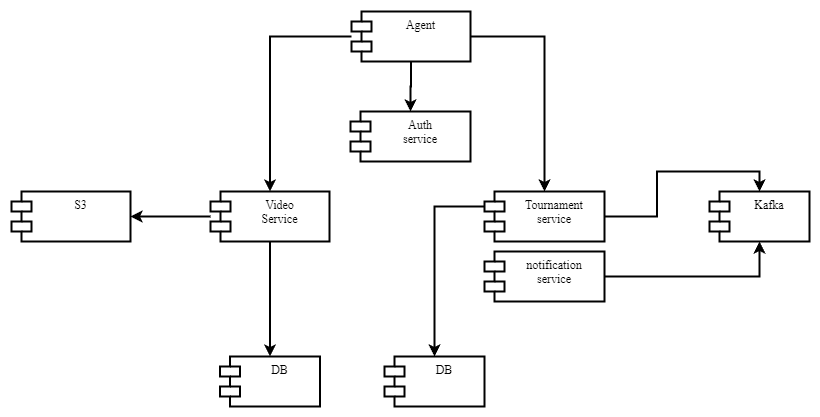
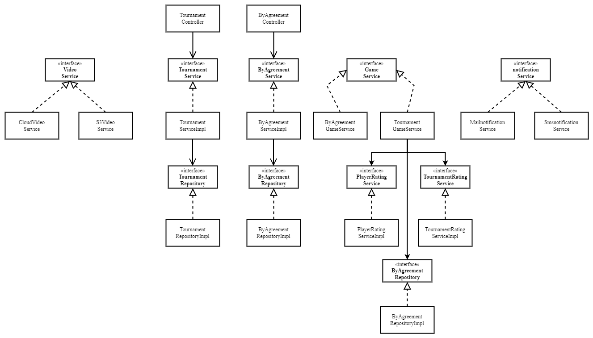
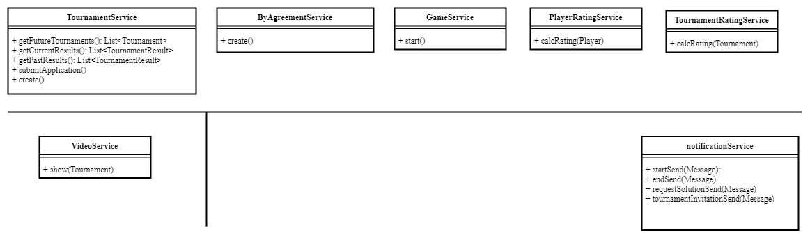

<h2>Компоненты</h2>
1. Существует агент, с которого будет происходить обращение к апи.
2. Сначала происходит запрос в AuthService, в котором происходит аутентификация и выдается токен jwt. 
3. С jwt можно создать запрос в TournamentService (это компонент, внутри которого апи, сервисы как для работы с турнирами, так и с играми по договоренности)
4. В рамках TournamentService происходит создание игры (GameService), который запускается по расписанию и запускает ServerThread, внутри которого выполняется сама игра.
5. TournamentService пишет в базу (например, участников игры, саму игру).
5. Между TournamentService и NotificationService микросервисами происходит общение через кафку. NotificationService читает сообщения из кафки и производит нотификацию по какому - либо событию (будто то старт, окончание игры).
6. Через VideoService можно посмотреть запись игры (например, которая хранится в s3). Из базы вычитываются пути к видео.

Узкие места: 
если агент будет взаимодействовать через http/https с сервером (то есть отправлять запросы command, например),
то при большом количестве участников может быть превышена допустимая нагрузка. В таком случае возможно стоит рассмотреть взаимодействие через кафку, например.
Компоненты, к которым будут меняться требования чаще всего:
- NotificationService (как отправлять оповещение)
- PlayerRatingService (как считается рейтинг игрока, может быть много вариаций)